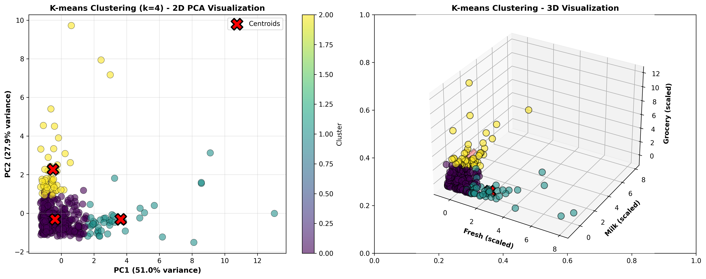
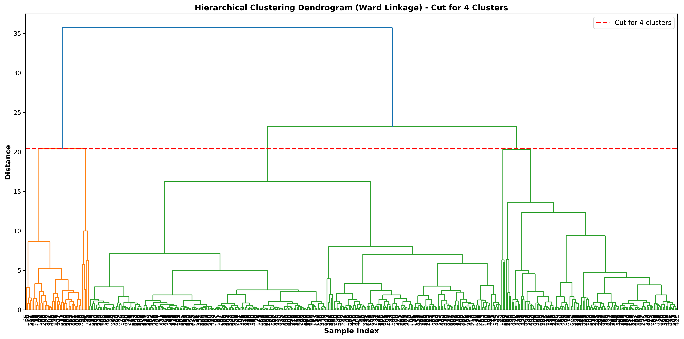
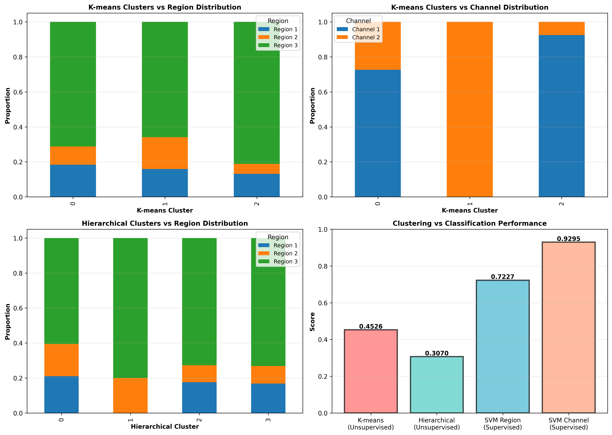

<p align="center">
  
</p>

<h1 align="center"> Data Mining Project — Wholesale Customer Clustering</h1>

<p align="center">
  <a href="https://github.com/Zahra58"></a>
  <a href="https://www.linkedin.com/in/zahraetebari/"></a>
  
  
  
  
</p>

---

##  Project Overview
This project focuses on **customer segmentation** using the **Wholesale Customers Dataset**.  
Through data preprocessing, clustering, and classification models, we aim to group customers with similar purchasing behaviors and build predictive models to understand customer patterns.

---

##  Objectives
- Perform **data cleaning and standardization**
- Use **K-Means** and **Hierarchical Clustering** for segmentation
- Visualize cluster results and analyze customer profiles
- Train and evaluate classification models to predict customer regions

---

##  Workflow
1. **Data Preprocessing:**  
   - Missing value handling, scaling, and normalization  
2. **Exploratory Data Analysis:**  
   - Correlation heatmaps, distribution plots  
3. **Clustering Techniques:**  
   - K-Means, Hierarchical, DBSCAN with Silhouette analysis  
4. **Classification Models:**  
   - SVM, Decision Tree, Random Forest, Logistic Regression, KNN  
5. **Visualization:**  
   - Dendrograms, cluster scatter plots, and performance comparison charts  
6. **Model Saving:**  
   - Exported trained models as `.pkl` files for deployment

---
## 🛠️ Tech Stack
| Category | Tools Used |
|-----------|-------------|
| Language | Python |
| Libraries | `pandas`, `numpy`, `scikit-learn`, `matplotlib`, `seaborn` |
| Environment | Google Colab |
| Version Control | GitHub |

---

##  Example Visualizations

| K-Means Clusters | Hierarchical Dendrogram | Model Performance |
|------------------|--------------------------|-------------------|
|  |  |  |

---

##  Directory Structure
data-mining-project--wholesale-customer-clustering/
│
├──  data_mining.ipynb # Main Colab notebook
├──  data/ # Raw & preprocessed data
│ ├── data-A.csv
│ └── preprocessed_data.csv
├──  images/ # Saved visualizations
│ ├── dendrogram.png
│ ├── silhouette_analysis.png
│ ├── kmeans_clusters_visualization.png
│ └── model_accuracy_comparison.png
├──  models/ # Trained model files
│ ├── svm_model.pkl
│ ├── decision_tree_model.pkl
│ ├── random_forest_model.pkl
│ ├── log_reg_model.pkl
│ └── knn_k3_model.pkl
├──  README.md # Project documentation
├──  requirements.txt # Dependencies
└──  LICENSE # MIT License

---


##  Trained Models
| Model Type           | File Path | Description |
|----------------------|------------|--------------|
| SVM Classifier       | `models/svm_model.pkl` | Support Vector Machine used for classification |
| Decision Tree        | `models/decision_tree_model.pkl` | Tree-based model for interpretability |
| Random Forest        | `models/random_forest_model.pkl` | Ensemble learning for better generalization |
| Logistic Regression  | `models/log_reg_model.pkl` | Baseline linear classifier |
| KNN (k=3)            | `models/knn_k3_model.pkl` | Instance-based learner |

---

##  Results Snapshot
| Model | Accuracy |
|--------|-----------|
| Logistic Regression | **0.727** |
| Random Forest | **0.682** |
| KNN (k=3) | **0.667** |
| Decision Tree | **0.553** |
| SVM | **0.409** |

> Logistic Regression performed best on this dataset.

---

##  How to Run

### 1️ Clone the Repository
```bash
git clone https://github.com/Zahra58/data-mining-project--wholesale-customer-clustering.git
cd data-mining-project--wholesale-customer-clustering

--- 
2️. Install Dependencies

pip install -r requirements.txt
 ---
3️. Run the Notebook

Open data_mining.ipynb in Jupyter or Google Colab.

Execute all cells in order.

Check generated visualizations in /images/.

---
🧾 Requirements
numpy
pandas
matplotlib
seaborn
scikit-learn
joblib

---
 Author

 Zahra Etebari
 AI Engineer | Data Scientist
 LinkedIn: www.linkedin.com/in/zahra-etebari | GitHub: github.com/Zahra58

---
License

This project is licensed under the MIT License — you’re free to use, modify, and distribute it with attribution.

---
⭐ If you found this project helpful, give it a star on GitHub and connect on LinkedIn


