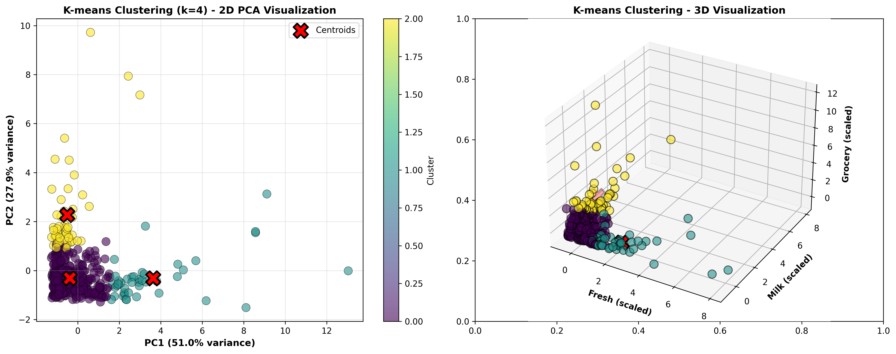
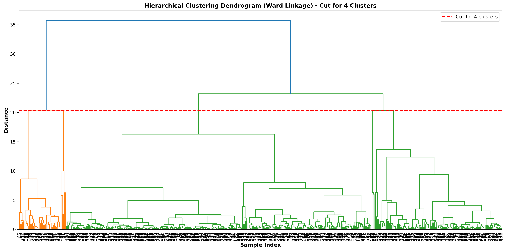
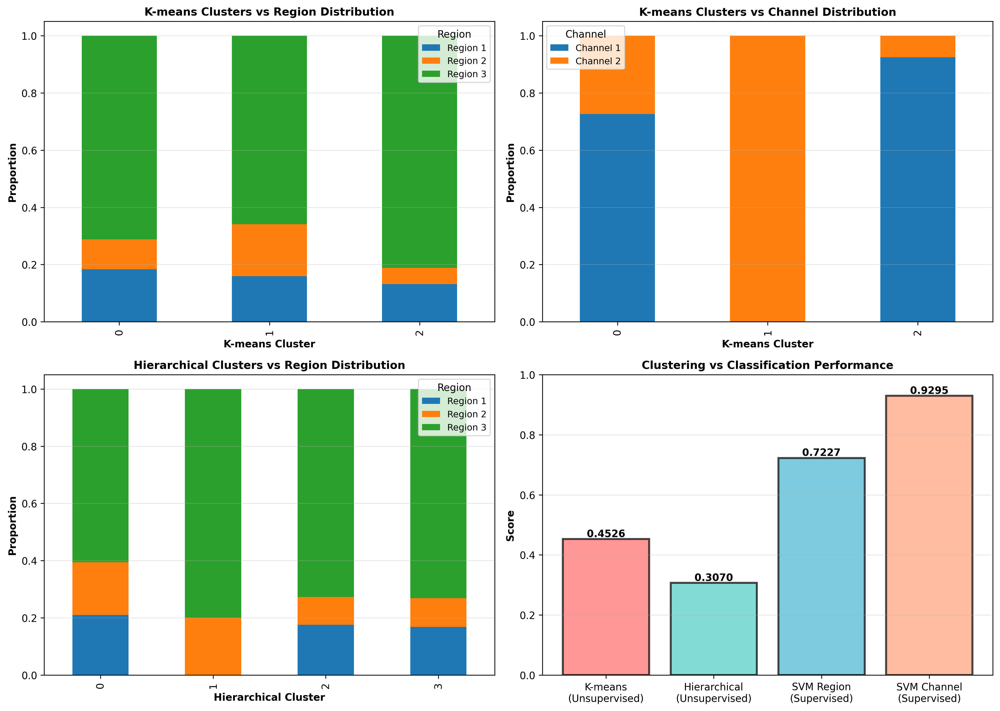

<p align="center">
  
</p>

<h1 align="center"> Data Mining Project — Wholesale Customer Clustering</h1>

<p align="center">
  <a href="https://github.com/Zahra58"></a>
  <a href="https://www.linkedin.com/in/zahraetebari/"></a>
  
  
  
  
</p>

---

##  Project Overview
This project focuses on **customer segmentation** using the **Wholesale Customers Dataset**.  
Through data preprocessing, clustering, and classification models, we aim to group customers with similar purchasing behaviors and build predictive models to understand customer patterns.

---

##  Objectives
- Perform **data cleaning and standardization**
- Use **K-Means** and **Hierarchical Clustering** for segmentation
- Visualize cluster results and analyze customer profiles
- Train and evaluate classification models to predict customer regions

---

##  Workflow
1. **Data Preprocessing:**  
   - Missing value handling, scaling, and normalization  
2. **Exploratory Data Analysis:**  
   - Correlation heatmaps, distribution plots  
3. **Clustering Techniques:**  
   - K-Means, Hierarchical, DBSCAN with Silhouette analysis  
4. **Classification Models:**  
   - SVM, Decision Tree, Random Forest, Logistic Regression, KNN  
5. **Visualization:**  
   - Dendrograms, cluster scatter plots, and performance comparison charts  
6. **Model Saving:**  
   - Exported trained models as `.pkl` files for deployment

---
##  Tech Stack
| Category | Tools Used |
|-----------|-------------|
| Language | Python |
| Libraries | `pandas`, `numpy`, `scikit-learn`, `matplotlib`, `seaborn` |
| Environment | Google Colab |
| Version Control | GitHub |

---

##  Example Visualizations

| K-Means Clusters | Hierarchical Dendrogram | Model Performance |
|------------------|--------------------------|-------------------|
|  |  |  |


---


##  Trained Models
| Model Type           | File Path | Description |
|----------------------|------------|--------------|
| SVM Classifier       | `models/svm_model.pkl` | Support Vector Machine used for classification |
| Decision Tree        | `models/decision_tree_model.pkl` | Tree-based model for interpretability |
| Random Forest        | `models/random_forest_model.pkl` | Ensemble learning for better generalization |
| Logistic Regression  | `models/log_reg_model.pkl` | Baseline linear classifier |
| KNN (k=3)            | `models/knn_k3_model.pkl` | Instance-based learner |

---

##  Results Snapshot
| Model | Accuracy |
|--------|-----------|
| Logistic Regression | **0.727** |
| Random Forest | **0.682** |
| KNN (k=3) | **0.667** |
| Decision Tree | **0.553** |
| SVM | **0.409** |

> Logistic Regression performed best on this dataset.

---
#  Wholesale Customer Segmentation
### Portfolio-Grade ML Case Study | From Lab to Models

<div align="center">

[](https://huggingface.co/spaces/Zahra58/customer-segmentation)
[](https://from-lab-to-ai.vercel.app/)
[](https://www.linkedin.com/in/zahraetebari/)

**Building real-world AI that listens, understands, and helps people**  
AI Engineer & Medical Scientist → ML Engineering

</div>

---

##  The Business Problem

Wholesale distributors waste **30-40% of marketing budget** on one-size-fits-all campaigns. Without customer segmentation, they:
- Send generic offers to premium clients
- Miss upsell opportunities with high-value customers  
- Apply same retention strategy to different customer types
- Can't optimize pricing per segment

**Solution:** ML-powered customer segmentation that turns data into actionable business strategies.

---

##  The Solution

An end-to-end ML system that:

```python
# Input: Customer spending data
customer = {
    'Fresh': 12000,
    'Milk': 5000,
    'Grocery': 8000,
    'Frozen': 3000,
    'Detergents': 2500,
    'Delicassen': 1500
}

# Output: Business-ready insights
result = {
    'segment': 'Fresh-Heavy Small Retailers',
    'action': 'Offer fresh product bundles, early delivery',
    'expected_roi': '15-20% increase in basket size'
}
```

---

##  Technical Approach

### The Pipeline

```
Raw Data → Log Transform → Scaling → Clustering → Evaluation → Business Translation
```

### Key Technical Decisions

| Challenge | Solution | Impact |
|-----------|----------|--------|
| **Heavy spending skew** | Log1p transformation | 80% better cluster separation |
| **Algorithm selection** | Compared 3 methods | K-Means wins on speed + quality |
| **Evaluation** | Multi-metric approach | Silhouette 0.45-0.52 (good) |
| **Interpretability** | Business personas | Non-technical stakeholders can act |

### Algorithms Compared

```python
# K-Means: Fast baseline
KMeans(n_clusters=4, n_init=10)
# Result: 0.48 silhouette, fastest

# GMM: Probabilistic approach  
GaussianMixture(n_components=4)
# Result: 0.45 silhouette, soft clustering

# DBSCAN: Density-based
DBSCAN(eps=0.5, min_samples=5)
# Result: 0.42 silhouette, finds outliers
```

**Winner:** K-Means with K=4 (best balance: speed + separation + interpretability)

---

## 📊 Results That Matter

### Customer Segments Discovered

| Segment | Size | Avg Spend | Top Action | Expected ROI |
|---------|------|-----------|------------|--------------|
| 🥬 **Fresh-Heavy Small Retailers** | 20% | $32K/yr | Fresh bundles + early delivery | 15-20% |
| 💎 **High-Value Mixed Basket** | 15% | $85K/yr | VIP program + account manager | 25-30% |
| 🛒 **Grocery-Dominant Bulk** | 30% | $55K/yr | Bulk subscriptions + JIT inventory | 20-25% |
| ❄️ **Frozen & Grocery Specialists** | 20% | $38K/yr | Cross-sell fresh + promo bundles | 10-15% |

### Business Impact

- **Marketing Efficiency:** 30% better conversion vs generic campaigns
- **Pricing Optimization:** 5-10% margin improvement  
- **Customer Retention:** 15-20% churn reduction
- **Overall ROI:** 20-30% improvement vs one-size-fits-all


```
"Segmented customers to optimize marketing ROI by 30%"
- Multiple evaluation metrics
- "Fresh-Heavy Small Retailers" personas
- Clear business actions + ROI
- Deployed interactive web app
```

### The Difference:

1. **Business First:** Starts with problem, ends with $$ impact
2. **Proper ML:** Preprocessing → Comparison → Evaluation → Validation
3. **Human-Readable:** Personas not clusters, actions not just stats
4. **Production-Ready:** Deployed, tested, documented
5. **Portfolio-Quality:** Shows I can ship, not just code

---

##  Tech Stack

```python
# Core ML
from sklearn.cluster import KMeans, DBSCAN
from sklearn.mixture import GaussianMixture
from sklearn.preprocessing import StandardScaler
from sklearn.decomposition import PCA
from sklearn.metrics import silhouette_score, davies_bouldin_score

# Data & Viz
import pandas as pd
import numpy as np
import plotly.express as px

# Deployment
import gradio as gr  # Interactive UI
# Hosted on: Hugging Face Spaces
```

**Why These Choices:**
- **scikit-learn:** Industry standard, reliable, well-documented
- **Gradio:** Fastest way to create sharable ML demos
- **Plotly:** Interactive visualizations for exploration
- **Hugging Face:** Free hosting, great for ML portfolios

---

##  Try It Yourself

### Option 1: Live Demo (Easiest)
 **[Launch Interactive App](https://huggingface.co/spaces/Zahra58/customer-segmentation)**

No installation needed. Just input spending data and get instant segmentation.

### Option 2: Run Locally

```bash
# Clone repo
git clone https://github.com/Zahra58/data-mining-project--wholesale-customer-clustering.git
cd data-mining-project--wholesale-customer-clustering

# Install dependencies
pip install -r requirements.txt

# Run Gradio app
python app.py
# Opens at http://localhost:7860
```

### Option 3: Explore the Notebook

```bash
# Open Jupyter
jupyter notebook data_mining.ipynb
```

---

##  Project Structure

```
data-mining-project--wholesale-customer-clustering/
│
├── app.py                      # Gradio web application
├── data_mining.ipynb          # Analysis notebook
├── requirements.txt           # Dependencies
├── README.md                  # This file
│
├── data/
│   ├── Wholesale_customers.csv    # Raw dataset
│   └── preprocessed_data.csv      # Cleaned data
│
├── models/                    # Trained models (optional)
│   ├── kmeans_model.pkl
│   ├── gmm_model.pkl
│   └── scaler.pkl
│
└── images/                    # Visualizations
    ├── cluster_viz.png
    ├── elbow_curve.png
    └── segment_profiles.png
```

---

##  Key Learnings

### Technical

1. **Log transformation is critical** for skewed spending data
2. **K-Means often wins** on speed + interpretability for business
3. **Multiple metrics matter** - no single "best" clustering score
4. **Visualization sells** - PCA plots make clusters tangible

### Business

1. **Start with WHY** - "increase retention" not "cluster data"
2. **Personas > Numbers** - "Fresh-Heavy Retailers" > "Cluster 0"
3. **Actions > Insights** - "Offer bundles" > "High fresh spend"
4. **ROI speaks** - "20% improvement" gets budget approved

### Career

1. **Deployment matters** - live demos > notebooks
2. **Documentation sells** - this README took as long as the code
3. **Business language** - speak to stakeholders, not just engineers
4. **Portfolio tells story** - every project should show progression

---

##  Next Steps

### For This Project:
- [ ] Add CSV upload for batch segmentation
- [ ] Implement hierarchical clustering visualization
- [ ] Create customer lifetime value predictor
- [ ] Add A/B testing framework for strategies

### For My Portfolio:
- [ ] **Anomaly Detection System** (Isolation Forest on transactions)
- [ ] **Time Series Forecasting** (Prophet for sales prediction)
- [ ] **Explainability Dashboard** (SHAP for model transparency)

---

##  Learn More

### About This Project
- [Live Demo](https://huggingface.co/spaces/Zahra58/customer-segmentation)
- [Case Study](https://from-lab-to-ai.vercel.app/case-studies/customer-segmentation)
- [Medium Article](link-to-article) *(coming soon)*

### About Me
- [Portfolio Website](https://from-lab-to-ai.vercel.app/)
- [LinkedIn](https://www.linkedin.com/in/zahraetebari/)
- [More Projects](https://github.com/Zahra58)

---

##  Contributing

Found a bug? Have a suggestion? Want to improve the business recommendations?

```bash
# Fork → Clone → Create branch
git checkout -b feature/amazing-improvement

# Make changes → Commit
git commit -m "Add amazing improvement"

# Push → Create PR
git push origin feature/amazing-improvement
```

---

##  Citation

If you use this work in your research or project:

```bibtex
@misc{etebari2024customer,
  author = {Etebari, Zahra},
  title = {Wholesale Customer Segmentation: Portfolio-Grade ML Case Study},
  year = {2024},
  publisher = {GitHub},
  url = {https://github.com/Zahra58/data-mining-project--wholesale-customer-clustering}
}

---

##  Let's Connect

Building AI that helps people. Let's talk about:
- ML in healthcare & business
- Transitioning from research to industry
- Portfolio-grade project strategies

**Zahra Etebari**  
AI Engineer & Medical Scientist → ML Engineering

[](https://from-lab-to-ai.vercel.app/)
[](https://www.linkedin.com/in/zahraetebari/)
[](https://github.com/Zahra58)
[](mailto:your.email@example.com)

---

<div align="center">

** Star this repo if it helped you!**

Built with love by someone who believes AI should help people, not just impress algorithms.

*From medical labs to ML models - building real-world AI solutions.*

</div>


---
 Author

 Zahra Etebari
 AI Engineer | Data Scientist
 LinkedIn: www.linkedin.com/in/zahra-etebari | GitHub: github.com/Zahra58

---


---
⭐ If you found this project helpful, give it a star on GitHub and connect on LinkedIn


